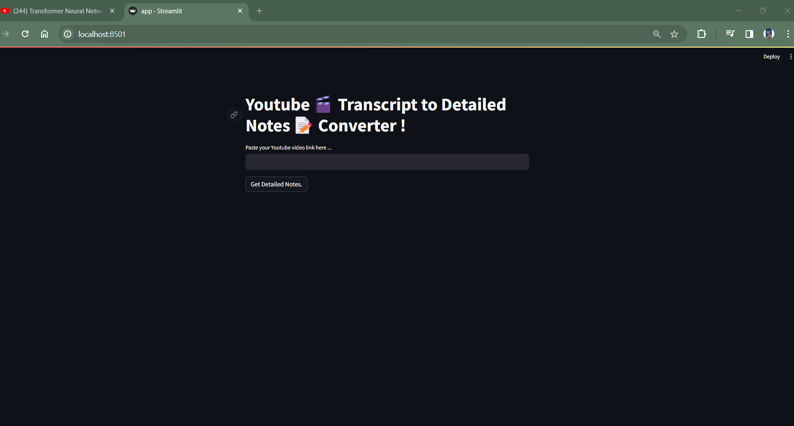
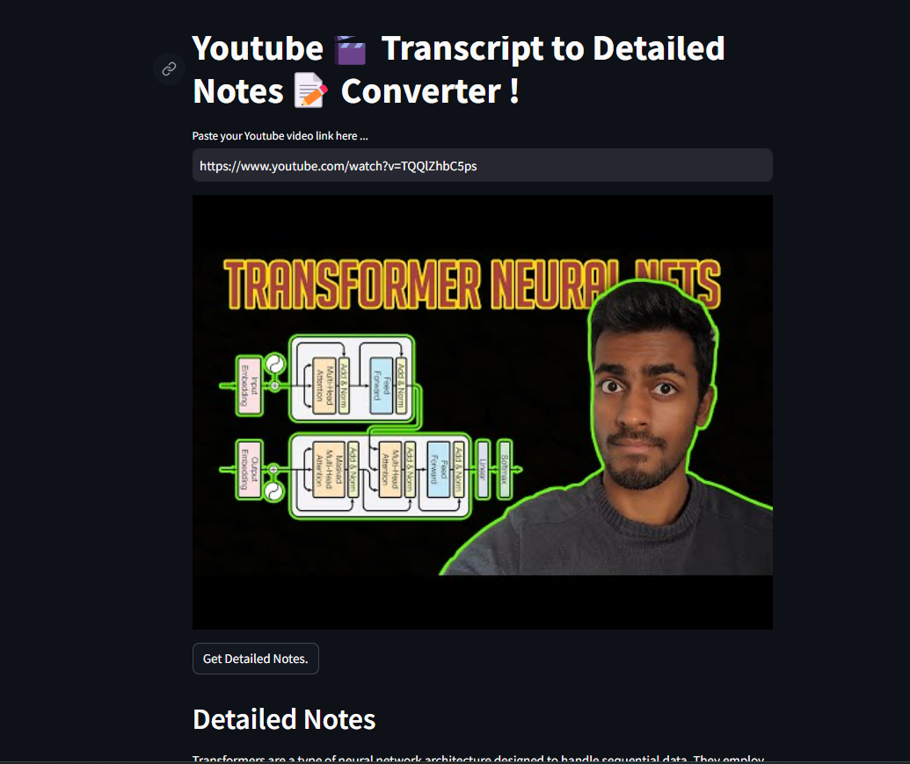
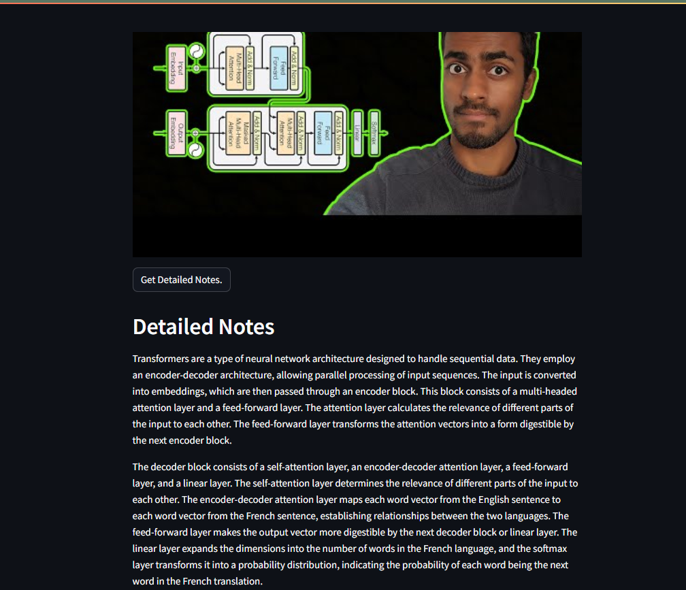

## DESCRIPTION - 
- # This is a smart notes maker app that can make a summarized detailed notes from a youtube video
- # It requires youtube link as an input and it will display thumbnail + detailed notes for the youtube

## Tech used -
- Youtube Transcript Api (to extract the transcript the youtube link)
- Google Gemini Pro LLM (to take the prompt and transcript as an input to generate the output as response)
- Streamlit (To build complete UI)
- Please paste your gemini pro API in .env file.

## Read about Gemini pro LLM - https://blog.google/technology/ai/google-gemini-ai/#capabilities

## Screenshot of the UI
- BASE UI 

- Thumbnail Generation

- Detailed Notes - 
